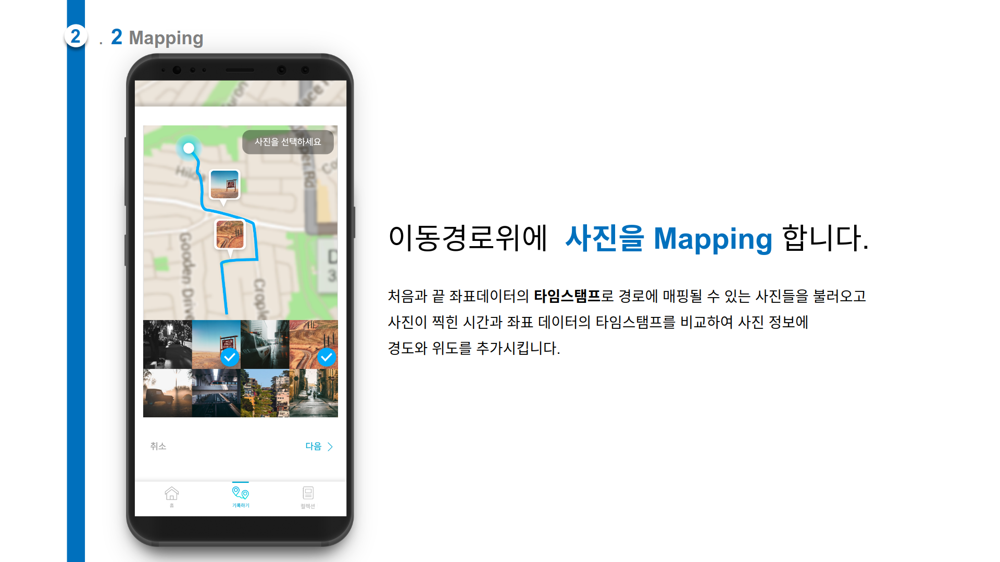

선선-Ver1
=============
# 2019년 1학기 캡스톤 디자인 프로젝트
*****

## 과제 목적 및 배경

오늘날 사람들은 다른 사람들과 안부를 주고받으며 소통하는 수단으로 '소셜 네트워크 서비스(SNS)’를 가장 많이 사용하고 있습니다. 예를 들어 이미지, 동영상을 업로드하는 트위터, 온라인 사진 공유 SNS인 인스타그램과 비즈니스 목적의 SNS인 링크드인 등등 많은 SNS가 우리의 삶에 녹아있습니다.
  
본 과제에서는 위와 같이 널리 사용되는 SNS에 손쉽게 공유할 수 있는 콘텐츠를 제작하는 안드로이드 앱을 구상 중입니다. 콘텐츠는 특정 시간 동안 사용자가 걸어 다녔던 경로와 그리고 사용자가 찍은 사진을 지도위에 올림으로써 사진 한 장에 사용자의 하루를 담는 것입니다.

기존의 SNS 영역에 침범하지 않으면서도 조화롭게 어울릴 수 있는 폐쇄형 SNS를 개발하는게 본 과제의 목표입니다. 더 나아가서는 경로 데이터와 좌표 데이터로 유의미한 데이터를 도출해내고 시각화하는 것이 최종 목표입니다.

## 과제 수행 내용 및 방법(과정)

본 과제에서는 데이터 저장과 통신을 위해 Web Api Server, DB Server를 구축하였고 Android App 개발은 React Native, Redux 패턴, Redux-Saga 미들웨어를 사용하여 진행했습니다.

<b>[react-native]</b>  : React Native는 React의 접근방법을 모바일로 확장한 Facebook의 오픈소스 프로젝트이다. React는 MVC 디자인패턴 중 V에 해당하는 부분을 컴포넌트로 만들기 위한 라이브러리 입니다. 

<b>[redux]</b> : Redux는 가장 사용률이 높은 상태관리 라이브러리 입니다. 본 과제에서는 데이터의 양방향 흐름을 단방향으로 바꾸기 위해 사용했습니다. 

<b>[redux-saga]</b> : Redux의 사이드 이펙트, 예를 들어 fetching이나 브라우저 캐시에 접근하는 순수하지 않은 비동기 동작들을, 더 쉽고 좋게 만드는 것을 목적으로 하는 라이브러리 입니다. 

<b>[Web Server]</b> : Post방식을 통해 데이터를 전달받고 DB Server와 Android의 다리 역할을 합니다. 

<b>[DB Server]</b> : 하나의 기능을 하나의 저장프로시저가 갖도록 구현하여 네트워크 소요시간을 줄이고 보안성을 높였습니다.

## 과제 결과 및 성과
### Views

    

   

### 메인 알고리즘

#### Tracking

#### Mapping

#### Clustering

#### Editing

#### Sharing

#### Tracking - Mapping - Clustering : 시연 동영상

## 4 기대효과

경로 데이터와 사용자의 정보를 결합하여 의미있는 데이터를 도출하는 것을 기대하며 그 정보를 필요로 하는 사람들한테 제공하여 가치있는 활용을 기대합니다.

## 5 수상내역

은상을 받았습니당...! 기대 전혀 안하고 있었는데 받아서 더욱 좋았습니다. ㅎㅎ  

 은상!!

## 6 끝마치며

>지금까지 파이썬을 사용해서 잘 해왔으니깐 이번에도 파이썬을 사용해서 해봐야지!

가 아닌 

>나 이런거 만들고 싶은데 뭘 배워야 되지?

라는 마인드로 시작한 프로젝트이기 때문에 새로운 것들을 배워야 하는 시간이 있었고 그로 인해 상대적으로 많은 기능을 개발할 수 없었습니다. :sad:

이 프로젝트를 진행하는 동안 Javascript 를 어느 정도 얕게 배울 수 있었고 react-native 라는 좋은 라이브러리와 redux 라는 디자인 패턴 redux-saga 라는 미들웨어를 사용해 보면서 많은 경험을 얻었습니다.

특히 디자인 패턴과 미들웨어는 수업시간에 이론으로 배웠을 때는 굳이 필요한가? 라는 생각이 많았는데 직접 사용해보니 필요성을 많이 체감했습니다.

~2달 동안 코드를 짜면서 애착이 많이 간 프로젝트이기 때문에 실력을 더욱 키워서 sunsun-ver2 를 만들 예정이고 그 때는 스파게티 코드가 아닌 가독성과, 재사용성, 유지보수가 좋은 코드로 작성해야겠다.~
